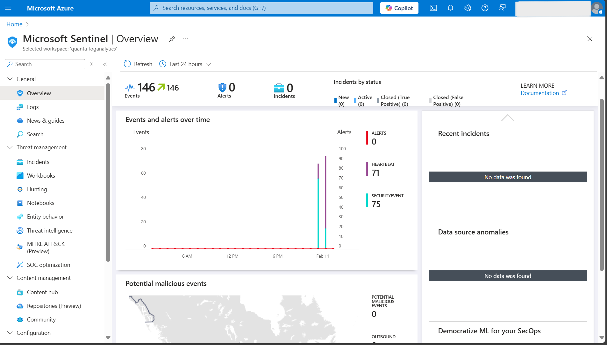

# Overview

This project involved setting up a mini Security Operations Center (SOC) environment using Microsoft Azure. The goal was to simulate real-world cybersecurity monitoring by exposing a virtual machine (VM) to public internet traffic, capturing events, and analyzing security logs using Microsoft Sentinel, a cloud-native Security Information and Event Management (SIEM) solution.



# Implementation Details

### Virtual Machine (VM) Deployment & Exposure
*   A Windows-based **VM** was created in Microsoft Azure and configured to allow Remote Desktop Protocol **(RDP)** access from public IP addresses.
*   This setup intentionally exposed the VM to potential security threats to simulate **real-world attack scenarios** and unauthorized access attempts.

### Data Connection to Microsoft Sentinel

*   **Microsoft Sentinel** was used as the **SIEM** platform to aggregate and analyze security logs.
*   A data connector was established between the Azure VM and Sentinel to collect security events, focusing on RDP access logs and user authentication attempts.

### Log Collection and Monitoring

- Configured data collection rules in Sentinel to track and analyze specific security events, including:
  - **Successful & Failed Sign-ins**: Recorded login attempts to identify suspicious activity.
  - **RDP Events**: Logged remote access sessions for threat detection.
  - **Incidents & Alerts**: Used Sentinel’s AI-driven analytics to detect potential security breaches.
- During the testing phase, **more than 1,000 RDP** events were recorded, along with all detected security incidents for analysis.

# Skills Acquired

*   **Cloud Computing & Virtualization** – Setting up and managing Azure-based virtual machines and networking configurations.
*   **Security Information and Event Management (SIEM) & Log Analysis** – Collecting, analyzing, and monitoring security logs in Microsoft Sentinel.
*   **Cybersecurity & Threat Intelligence** – Detecting threats, monitoring RDP events, and identifying unauthorized access attempts.
*   **Incident Response & Forensics** – Investigating security incidents, applying mitigation techniques, and enforcing security policies.

# Key Metrics & Results

*   Recorded over 1,000 RDP events within the testing period.
*   Successfully detected multiple security incidents related to unauthorized access.
*   Demonstrated real-world cybersecurity monitoring using cloud-based SIEM tools.


> This is a blockquote following a header.
>
> When something is important enough, you do it even if the odds are not in your favor.

### Header 3

```js
// Javascript code with syntax highlighting.
var fun = function lang(l) {
  dateformat.i18n = require('./lang/' + l)
  return true;
}
```

```ruby
# Ruby code with syntax highlighting
GitHubPages::Dependencies.gems.each do |gem, version|
  s.add_dependency(gem, "= #{version}")
end
```

#### Header 4

*   This is an unordered list following a header.
*   This is an unordered list following a header.
*   This is an unordered list following a header.

##### Header 5

1.  This is an ordered list following a header.
2.  This is an ordered list following a header.
3.  This is an ordered list following a header.

###### Header 6

| head1        | head two          | three |
|:-------------|:------------------|:------|
| ok           | good swedish fish | nice  |
| out of stock | good and plenty   | nice  |
| ok           | good `oreos`      | hmm   |
| ok           | good `zoute` drop | yumm  |

### There's a horizontal rule below this.

* * *

### Here is an unordered list:

*   Item foo
*   Item bar
*   Item baz
*   Item zip

### And an ordered list:

1.  Item one
1.  Item two
1.  Item three
1.  Item four

### And a nested list:

- level 1 item
  - level 2 item
  - level 2 item
    - level 3 item
    - level 3 item
- level 1 item
  - level 2 item
  - level 2 item
  - level 2 item
- level 1 item
  - level 2 item
  - level 2 item
- level 1 item

### Small image


### Large image


### Definition lists can be used with HTML syntax.

<dl>
<dt>Name</dt>
<dd>Godzilla</dd>
<dt>Born</dt>
<dd>1952</dd>
<dt>Birthplace</dt>
<dd>Japan</dd>
<dt>Color</dt>
<dd>Green</dd>
</dl>

```
Long, single-line code blocks should not wrap. They should horizontally scroll if they are too long. This line should be long enough to demonstrate this.
```

```
The final element.
```
